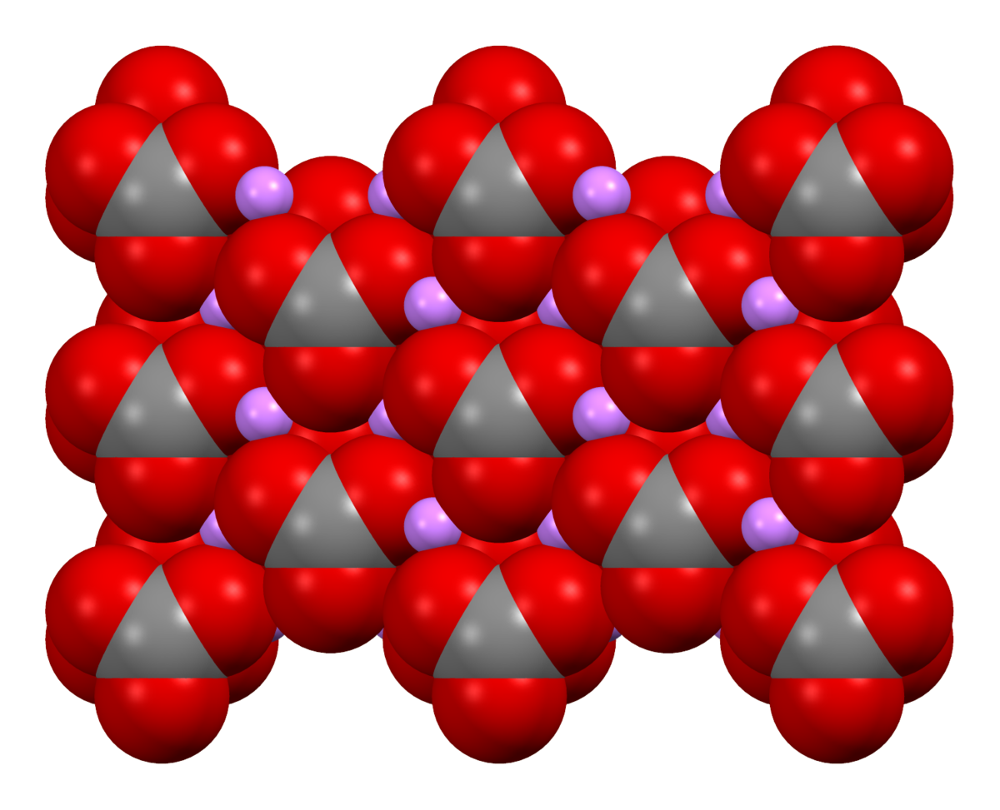
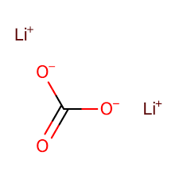

# Patient Data with Lithium Concentration Levels

  
  

## Description
This dataset contains information on **236 patients**, including various clinical and demographic variables. The dataset is designed for use in training machine learning models to **predict lithium concentration levels** based on patient data.

  

## Dataset Structure
The dataset is provided as a CSV file (`patients_data.csv`) with the following columns:

- **Patient_ID**: Unique identifier for each patient.
- **Daily_Dose**: Daily dose of medication (in mg). Lithium doses typically range from **300 to 900 mg per day**, but higher doses (up to **1200 mg/day**) are sometimes prescribed.
- **Age**: Age of the patient (in years). Patients' ages can realistically range from **18 to 65 years old**.
- **ALT**: Alanine aminotransferase levels (in U/L). Normal range is typically **7-56**.
- **AST**: Aspartate aminotransferase levels (in U/L). Normal range is typically **10-40**.
- **ALB**: Albumin levels (in g/dL). Normal range is typically **3.5-5.0**.
- **TBIL**: Total bilirubin levels (in mg/dL). Normal range is typically **0.1-1.2**.
- **Cr**: Creatinine levels (in µmol/L). Normal range for creatinine is typically **60-110** for women and **70-120** for men.
- **Zopiclone**: Binary indicator **(0 or 1)** if Zopiclone is co-administered.
- **Quinine**: Binary indicator **(0 or 1)** if Quinine is co-administered.
- **Tipine**: Binary indicator **(0 or 1)** if Tipine is co-administered.
- **Lorazepam**: Binary indicator **(0 or 1)** if Lorazepam is co-administered.
- **Olanzapine**: Binary indicator **(0 or 1)** if Olanzapine is co-administered.
- **Valproate**: Binary indicator **(0 or 1)** if Valproate is co-administered.
- **Metoprolol**: Binary indicator **(0 or 1)** if Metoprolol is co-administered.
- **Statins**: Binary indicator **(0 or 1)** if Statins are co-administered.
- **Li_Concentration**: Lithium concentration levels (in mmol/L). Therapeutic range for lithium is typically **0.6-1.2 mmol/L**.

## Data Summary
- **Number of Entries**: 236
- **Lithium Concentration Range**: 0.6 to 2.0 mmol/L
- **Higher-than-Typical Lithium Concentrations**: Approximately **20%** of the entries have lithium concentrations above the typical therapeutic range (1.2 to 2.0 mmol/L).

## Usage

  

This dataset can be used for various machine learning tasks, including but not limited to:
- Predicting lithium concentration levels based on patient clinical and demographic data.
- Studying the relationship between lithium concentration and various clinical variables.
- Evaluating the performance of regression models in predicting lithium levels.

## License
This dataset is provided for **educational and research purposes**. Proper attribution should be given if the dataset is used in any publications or presentations.
